# Visualización de Datos II
Puede acceder a la demo de la aplicación en **[http://edu.ajmonfue.me/adm-3/](http://edu.ajmonfue.me/adm-3/)**

## Enunciados
### 1. Para el framework de visualización desarrrollado en la práctica anterior, incorpora las modificaciones planteadas por el profesor durante la sesión de evaluación.

#### Añadir campo al formulario del cliente para indicar la columna de agrupación, útil para las gráficas de dispersión.
Para las gráficas de lineas y de barras dicho campo está deshabilitado, puesto que su valor se calcula segun el siguiente criterio:
* Si se selecciona sólo un campo para el `eje X`, el campo de agrupación será dicho campo.
* Si se selecciona múltiples campos en el `eje X` y un campo para el `eje Y`, el campo de agrupación corresponderá a este último. Nótese que el script de python fallará en el caso de especificar múltiples campos en ambos ejes.

Por otro lado, si estará habilitado en el caso se seleccione el tipo de gráfica de dispersión.

**Datos**: https://raw.githubusercontent.com/CSSEGISandData/COVID-19/master/csse_covid_19_data/csse_covid_19_daily_reports/04-06-2020.csv
| *Gráfica de dispersión no agrupado* | *Gráfica de dispersión agrupado por país* |
|---|---|
| 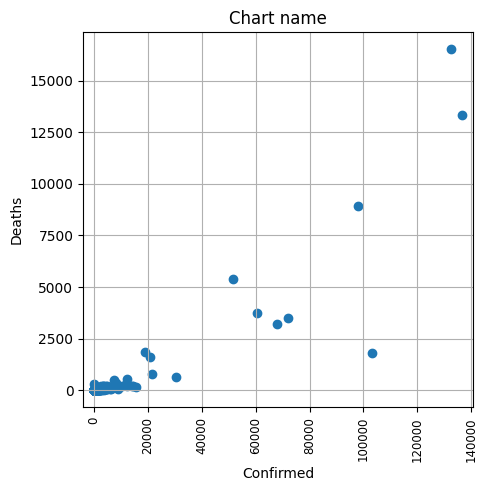 | 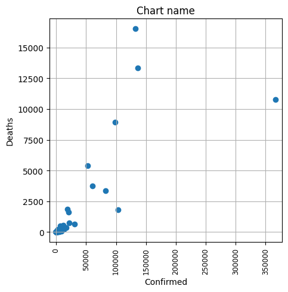 |

#### Añadir otros formatos de las fuentes de datos a representar, por ejemplo `.json`.
Se añade la importación de datos en formato `json` con la siguiente estructura:
```json
{
    "Country_Region": [
        "US",
        "Spain",
        "Mexico",
        ...
    ],
    "Confirmed": [
        100,
        200,
        300,
        ...
    ],
    ...
}
```

#### Permitir filtrar valores de los ejes
Se permite filtrar valores de uno de los ejes, según el siguiente criterio:
* Se permitirá filtrar valores del `eje X`, si se selecciona sólo un campo para el `eje X`.

**Datos**: https://raw.githubusercontent.com/CSSEGISandData/COVID-19/master/csse_covid_19_data/csse_covid_19_daily_reports/04-06-2020.csv

| *Formulario de gráfica sin campos filtrados (eje X)* | *Gráfica sin campos filtrados (eje X)* |
|---|---|
| 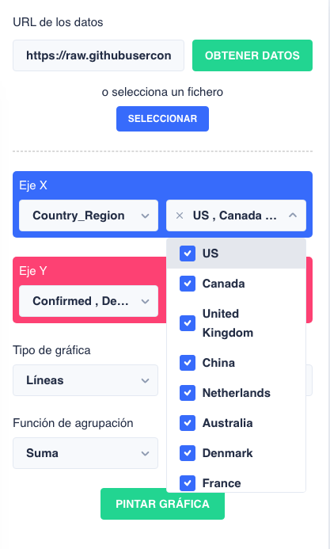 | 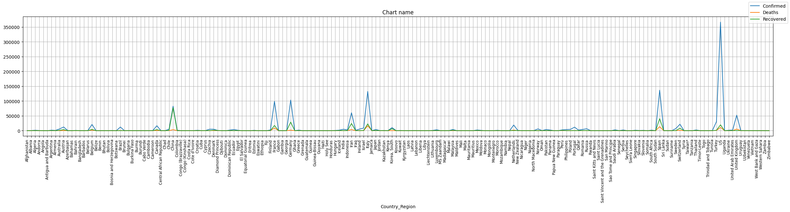 |

| *Formulario de gráfica con campos filtrados (eje X)* | *Gráfica con campos filtrados (eje X)* |
|---|---|
| 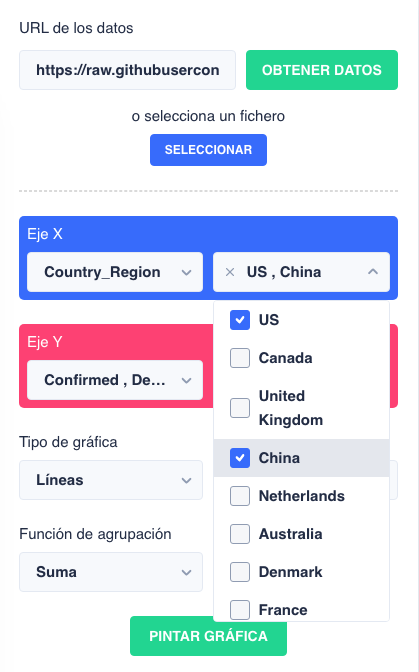 | 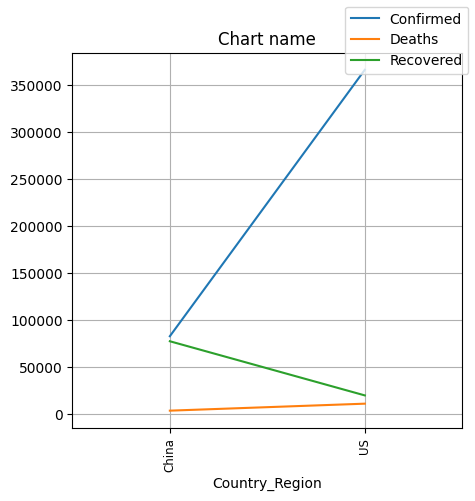 |


* Se permitirá filtrar valores del eje Y, si se selecciona múltiples valores para el `eje X` y un sólo valor para el `eje Y`.

**Datos**: https://raw.githubusercontent.com/CSSEGISandData/COVID-19/master/csse_covid_19_data/csse_covid_19_daily_reports/04-06-2020.csv

| *Formulario de gráfica sin campos filtrados (eje Y)* | *Gráfica sin campos filtrados (eje Y)* |
|---|---|
| 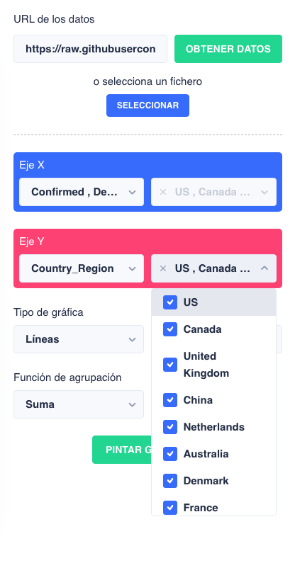 | 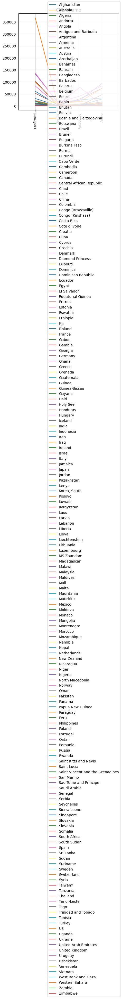 |

| *Formulario de gráfica con campos filtrados (eje Y)* | *Gráfica con campos filtrados (eje Y)* |
|---|---|
| 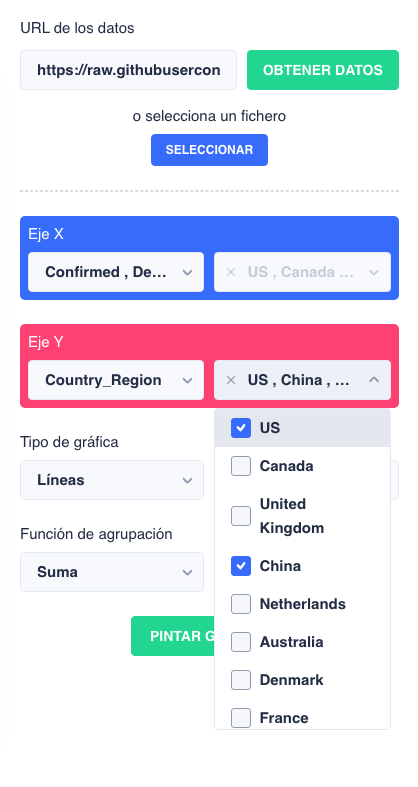 | 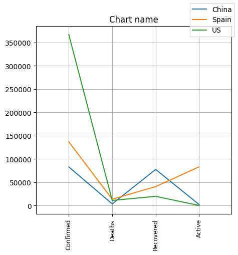 |

### 2. Analiza y familiarízate con la librería Seaborn.
Seaborn es una librería de visualización de datos para Python, desarrollada sobre matplotlib, que permite generar fácilmente elegantes gráficos. Como introducción, se ha seguido el siguiente artículo:
* https://www.analyticslane.com/2018/07/20/visualizacion-de-datos-con-seaborn/#:~:text=Seaborn%20es%20una%20librer%C3%ADa%20para,defecto%20en%20la%20distribuci%C3%B3n%20Anaconda

### 3. Incorpora al framework que has desarrollado la posibilidad de generar diagramas que permitan mostrar distribuciones de datos: histogramas, correlogramas, boxplots, curvas de densidad, diagramas de violín...
Se han incoporado los siguientes tipos de gráficos:

#### Violin
**Datos**: https://raw.githubusercontent.com/CSSEGISandData/COVID-19/master/csse_covid_19_data/csse_covid_19_daily_reports/08-02-2020.csv

Comando:
```
> python main.py --x-axis Country_Region --y-axis Confirmed --chart-type violin --data https://raw.githubusercontent.com/CSSEGISandData/COVID-19/master/csse_covid_19_data/csse_covid_19_daily_reports/08-02-2020.csv --group-by-func sum --x-select Italy Spain Germany France
```

| *Gráfica de violin* |
|---|
| 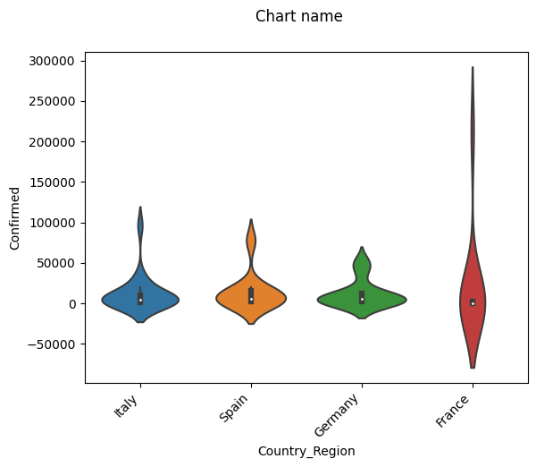 |

#### Cajas y bigotes
**Datos**: https://raw.githubusercontent.com/CSSEGISandData/COVID-19/master/csse_covid_19_data/csse_covid_19_daily_reports/08-02-2020.csv

Comando:
```
> python main.py --x-axis Country_Region --y-axis Confirmed --chart-type box --data https://raw.githubusercontent.com/CSSEGISandData/COVID-19/master/csse_covid_19_data/csse_covid_19_daily_reports/08-02-2020.csv --group-by-func sum --x-select Italy Spain Germany France
```

| *Gráfica de cajas y bigotes* |
|---|
| 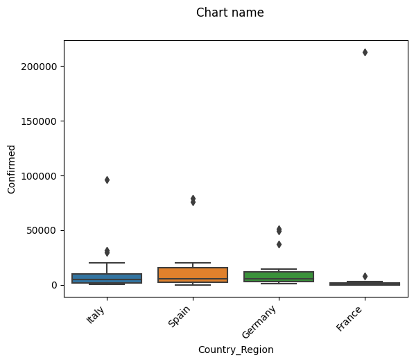 |

#### Histograma con diagrama de densidad
**Fuente original de los datos**: https://www.kaggle.com/acostasg/gourmet-supermarkets?select=analisis_data_o_hora_del_dia.csv
**Fichero**: [assets/data/analisis_data_o_hora_del_dia.csv](assets/data/analisis_data_o_hora_del_dia.csv)

Los datos del fichero difieren de la fuente original en que la primera columna, originalmente, era una cadena vacía, lo cual ocasionaba un error en el cliente, por ello se ha renombrado a `ID`.

Comando (Los datos se pasan por la entrada estándar):
```
> python main.py --x-axis HORA --chart-type histogram --group-by-func sum < analisis_data_o_hora_del_dia.csv
```

| *Gráfica de histograma con [KDE](https://en.wikipedia.org/wiki/Kernel_density_estimation)* |
|---|
| 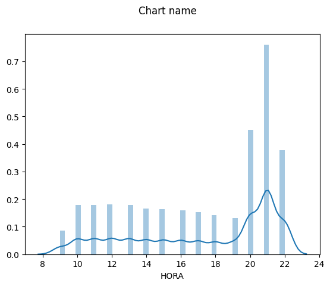 |

### 4. Con los conjuntos de datos considerados en las prácticas anteriores desarrolla el tratamiento que permita conocer la distribución de datos y extraer información relativa a comportamientos realizando comparativas de algunas variables: edad, país, género, periodos, ...

#### Coronavirus
**Datos**: https://raw.githubusercontent.com/CSSEGISandData/COVID-19/master/csse_covid_19_data/csse_covid_19_time_series/time_series_covid19_confirmed_global.csv

Se pretende analizar y comparar la evolución de casos confirmados de Covid-19 en los países España, Francia, Alemania e Italia entre el rango de fechas desde 28/06/2020 hasta 02/08/2020 cada 7 días. Para ello se ha utilizado la siguiente gráfica de líneas.

| *Evolución de Covid-19* |
|---|
| 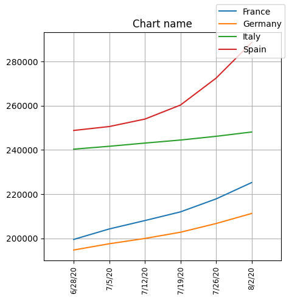 |

```bash
> python main.py --x-axis 7/12/20 7/19/20 7/26/20 8/2/20 --y-axis Country/Region --chart-type line --data https://raw.githubusercontent.com/CSSEGISandData/COVID-19/master/csse_covid_19_data/csse_covid_19_time_series/time_series_covid19_confirmed_global.csv --group-by-func sum --y-select Spain France Germany Italy
```

Como se puede ver, todos los paises de la gráfica tienen un aumento de casos confirmados por Covid-19 en este intervalo de tiempo, sin embargo, dicho incremento en España es bastante superior al resto de paises, cuyo crecimiento se ha acelerado en esta últimas dos semanas.


#### Conjunto de datos para supermercados gourmet
**Fuente original de los datos**: https://www.kaggle.com/acostasg/gourmet-supermarkets?select=analisis_data_o_hora_del_dia.csv
**Fichero**: [assets/data/analisis_data_o_hora_del_dia.csv](assets/data/analisis_data_o_hora_del_dia.csv)

Del conjunto de datos indicado, se pretende analizar qué individuos realizan, en general, compras con un importe total más elevado que el resto, y quiénes con un importe menor; de entre mujeres, hombres y empresas (columna `sexo` de los datos). Para ello se va a utilizar una gráfica de violin.

| *Importe total de compras por sexo y empresa* |
|---|
| 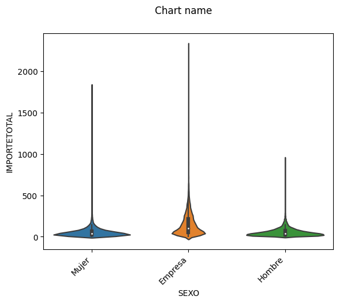 |


```bash
> python main.py --x-axis SEXO --y-axis IMPORTETOTAL --chart-type violin --group-by-func sum < analisis_data_o_hora_del_dia.csv
```

Como se puede ver en la gráfica, las empresas son las que realizan compras con un importe total más elevado, y los hombres con un importe total menor.


# Futuras mejoras
* Permitir especificar las dimensiones de la gráfica de matplotlib.
* Permitir descargar imágenes de las graficas.
* Visualización en pantalla completa.
* Sincronizar los valores de ejes seleccionados en la tabla. Señalar sólo aquellos seleccionados.
* Utilizar seaborn para las gráficas de líneas, scatter, y barras.
* Crear las gráficas con chart.js en el cliente, análogas a las creadas con seaborn.
* Permitir compartir links con los argumentos necesarios como query strings
