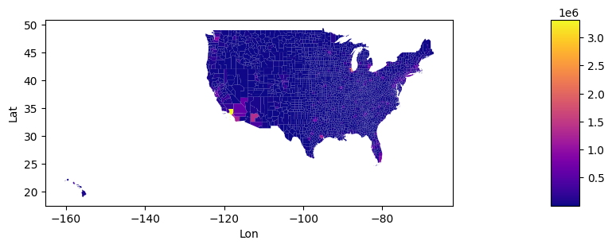
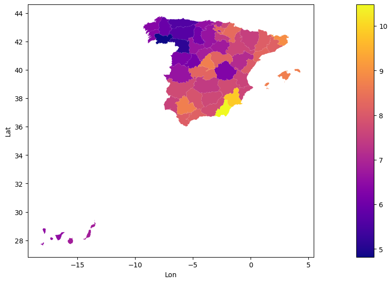
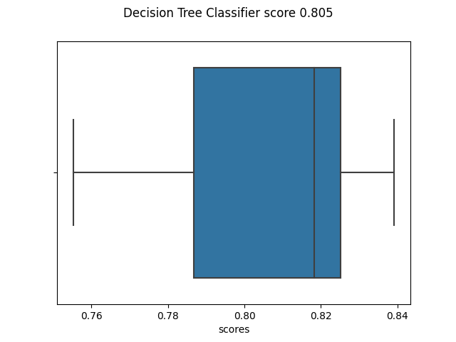

# Visualización de Datos IV


Puede acceder a la demo de la aplicación en **[https://edu.ajmonfue.me/adm-4/](https://edu.ajmonfue.me/adm-4/)**

## Enunciados
### 1. Extiende el framework anterior para que permita, con los conjuntos de datos que has estado considerando hasta este momento, representar esos datos utilizando mapas geográficos.
Para implementar la representación de mapas geográficos, se ha seguido el tutorial http://www.geomapik.com/desarrollo-programacion-gis/mapas-con-python-geopandas-matplotlib/. Dicha implementación se ha realizado sólo en script de python.

Se puede comprobar su funcionamiento ejecutando:
```bash
> ./iochart.py chart --x-axis total_2008 --chart-type map --data assets/us-elections.geojson --chart-file-name us-elections
```
El cual dará como resultado la gráfica en el fichero con nombre [`us-elections.png`](assets/us-elections.png).

| us-elections |
| --- |
|  |

O bien:
```bash
> ./iochart.py chart --x-axis NAT2018 --chart-type map --data assets/natalidad.geojson --chart-file-name natalidad
```
Que dará como resultado [`natalidad.png`](assets/natalidad.png)

| natalidad |
| --- |
|  |


### 2. Utiliza la librería scikit-learn para desarrollar algoritmos de aprendizaje sobre los conjunto de datos que has venido utilizando hasta este momento. El estudio debe considerar, al menos, un algoritmo de aprendizaje de supervisado de clasificación, uno de regresión y un algoritmo de aprendizaje no supervisado basado en clustering. Utiliza alguna herramienta que permita representar gráficamente el resultado que has obtenido.

### Algoritmos supervisados de clasificación
Es importante, para la ejecución de estos algoritmos, que las etiquetas tengan valores binarios, discretos. El fichero usado como ejemplo es [script/assets/titanic.csv](script/assets/titanic.csv), en el que cada fila almacena los datos de un pasajero del Titanic (nombre, sexo, edad, clase, etc) y su supervivencia en el accidente.

#### Naive Bayes
Para obtener el modelo a partir del algoritmo `Naive Bayes`, ejecutamos:
```bash
> ./iochart.py learn -a naive-bayes --data assets/titanic.csv -x Sex Pclass Fare Embarked Survived -y Survived
```
Nótese que con `-a` o `--algorithm` especificamos el algoritmo a ejecutar, en este caso `naive-bayes`.

Cuya ejecución dará como resultado algo similar a:
```bash
> ./iochart.py learn -a naive-bayes --data titanic.csv -x Sex Pclass Fare Embarked Survived -y Survived
Matriz confusión
[[91 19]
 [18 51]]
precision_score 0.7285714285714285
cross_val_score 0.8101898101898101
```

De igual forma, se mostrará una gráfica de cajas y bigotes a partir de las diferentes precisiones del modelo obtenidas.

| Precisión de Naive Bayes |
| --- |
|  |


#### Árboles de Decisión Clasificación
De forma similar que con el algoritmo `Naive Bayes`, para obtener el modelo a partir del algoritmo de árboles de decisión, ejecutamos:

```bash
> ./iochart.py learn -a tree-classifier --data assets/titanic.csv -x Sex Pclass Fare Embarked Survived -y Survived
```

Lo cual, dará como resultado, algo similar a:
```bash
> ./iochart.py learn -a tree-classifier --data assets/titanic.csv -x Sex Pclass Fare Embarked Survived -y Survived
Matriz confusión
[[101   6]
 [ 33  39]]
precision_score 0.8666666666666667
cross_val_score 0.8051948051948051
```

Y se mostrará la gráfica de cajas y bigotes con las precisiones obtenidas.

| Precisión de Árboles de Decisión Clasificación |
| --- |
|  |